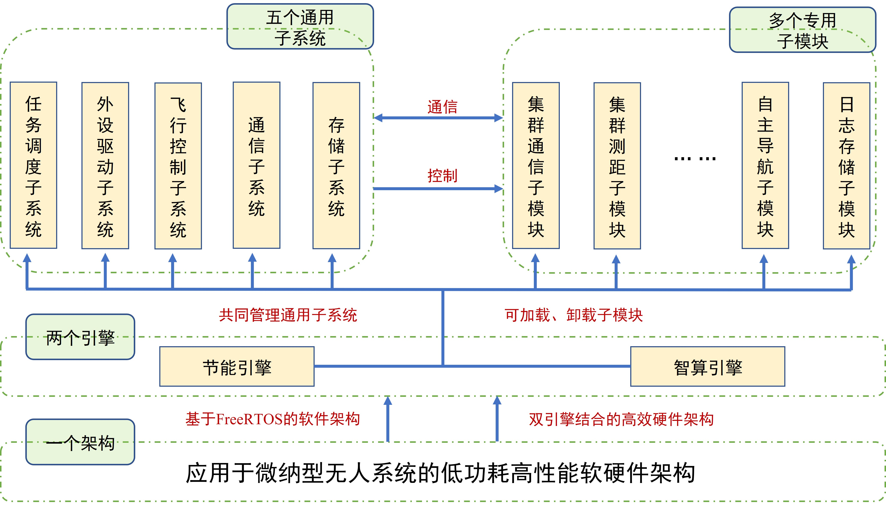

# Athena efficiency Firmware
## 产品介绍
**Athena (Co-processing deck)** 是由SEU-NetSI完全自主研发的一款适用于微型和纳型无人系统上感知和计算任务的硬件和软件系统。为了兼具能效和算力，Athena上配备两个计算单元，分别是Frenquently-on高能效感知计算单元和Standby高性能主计算单元。在本仓库实现的软硬件原型系统中，这两个计算单元分别由意法半导体公司的STM32L496和STM32H743担任。

为了在软件系统上更贴近用户，我们将Athena划分成了五个通用子系统：分别是低功耗任务调度子系统、低功耗通信子系统、外设驱动子系统、飞行控制子系统、存储子系统；这五大子系统是Athena软件系统的核心，也是每个应用都需要部署的系统。此外，Athena还支持用户自定义代码，称为多个专用子模块，目前，基于UWB技术的相对定位子模块、集群测距子模块；基于ToF技术的自主导航子模块；还有日志存储子模块等多种子模块已经在部署和测试阶段。

## 硬件适配情况
目前的最常用版本是Athena Gen 3 v3.5和Athena Gen 4 v4.3.

- [x] Athena **Gen 3** version 3.1 & 3.2 & 3.5(Athena Generation 3 已经暂停更新)
- [x] Athena **Gen 4** version 4.1 & 4.3
- [x] Athena **Gen 2** version 2.0 (Athena Generation 2 已经暂停更新)

## 致谢
国家自然科学基金面上项目“**基于超宽频技术的小微型无人系统集群协作关键技术研究与应用**”

国家自然科学基金面上项目“**微纳型无人系统集群协作导航关键技术研究**”

